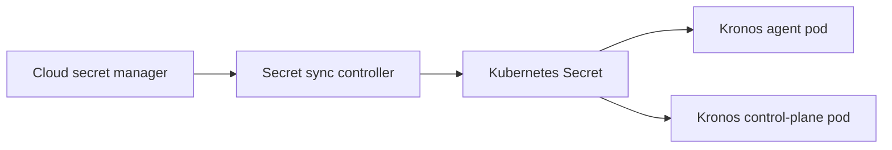

# Cloud Secret Integration

Kronos treats secrets as runtime inputs: bearer tokens, manifest signing keys,
chunk encryption keys, database credentials, and object-store credentials should
come from the platform secret manager rather than static config files.

## Kubernetes Pattern

Use Kubernetes Secrets only as the final delivery mechanism. Prefer syncing them
from a managed secret store with External Secrets Operator, CSI Secret Store, or
your platform's equivalent controller.



The example manifests expect an agent secret named `kronos-agent-secrets` with
these keys:

| Key | Used By | Purpose |
| --- | --- | --- |
| `token` | Agent | Bearer token with agent/job/resource scopes. |
| `manifest-private-key` | Agent | Ed25519 private key used to sign manifests. |
| `chunk-key` | Agent | 32-byte hex key used to encrypt backup chunks. |

## AWS Secrets Manager

Store each sensitive value as a separate secret or as a JSON object with stable
field names. Sync into Kubernetes with External Secrets Operator or the Secrets
Store CSI Driver. Limit the IAM role to read only the exact Kronos secret ARNs.

```yaml
apiVersion: external-secrets.io/v1beta1
kind: ExternalSecret
metadata:
  name: kronos-agent-secrets
  namespace: kronos
spec:
  refreshInterval: 1h
  secretStoreRef:
    name: aws-secrets-manager
    kind: ClusterSecretStore
  target:
    name: kronos-agent-secrets
  data:
    - secretKey: token
      remoteRef:
        key: prod/kronos/agent
        property: token
    - secretKey: manifest-private-key
      remoteRef:
        key: prod/kronos/agent
        property: manifest_private_key
    - secretKey: chunk-key
      remoteRef:
        key: prod/kronos/agent
        property: chunk_key
```

## Google Secret Manager

Use Workload Identity for the sync controller and grant `roles/secretmanager.secretAccessor`
only on the Kronos secret resources. Keep secret names environment-specific so
staging agents cannot read production keys.

## Azure Key Vault

Use workload identity or managed identity for the sync controller. Scope access
policies or RBAC assignments to the Kronos vault and prefer separate Key Vaults
per environment when compliance boundaries require it.

## Rotation Checklist

1. Create the replacement token or key in the cloud secret manager.
2. Wait for the sync controller to update the Kubernetes Secret.
3. Restart the affected Kronos pods so environment variables are reloaded.
4. Run `./bin/kronos token verify`, `./bin/kronos agent list`, and one backup
   verification.
5. Revoke or delete the old secret only after the replacement is confirmed.
